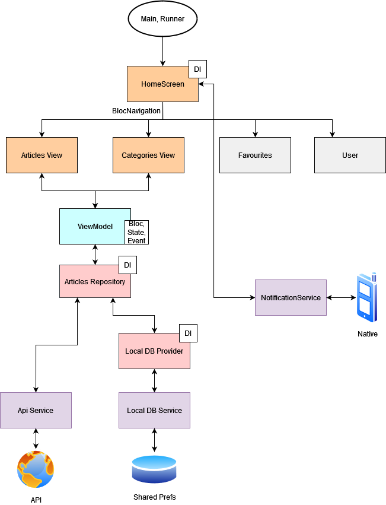

# news_app

### Для тестирования используйте VPN - особенности Rest API

## Схема архитектурного паттерна

## Работа

### Реализовано
1) Отображение списка всех статей.
- Проверка: Выбрать хотя бы 1 рубрику и перейти на экран с новостями.
3) Фильтрация статей по рубрикам.
- Проверка: Нажать на одну из рубрик.
4) Возможность перехода на полную версию статьи.
- Проверка: Нажать на одну из статей в списке.
5) При появлении новых статей список должен обновляться.
- Проверка: Нажать на одну из рубрик. С бека есть новые статьи? Список обновится. Нет - нет. (Возможно костыльно и тз преполагало другое, не буду переделывать)
6) Информация о последних 40 статьях должна храниться
локально и быть доступна при отсутствии связи с Интернет.
- Проверка: выключить инет или зайти в приложуху без него.
7) Должна быть реализована возможность добавления рубрик
статей в избранное. Если появляется новая статья по одной из
избранных рубрик, должно быть реализовано уведомление
(PUSH, электронная почта или другая механика). Через
уведомление пользователь должен переходить к просмотру
полной версии новой статьи.
- Проверка: Рубрика выбирается на экране рубрик, потом появляется в числе избранных на экране со статьями, если с бека новые статьи по рубрике, то придёт пуш со статьёй.
- Проверка: Как проверить пуш - нажать на кнопку "избранное" в списке статьей.
9) Реализовать поиск по загруженным статьям (по названию или
рубрике).
- Проверка: Воспользоваться TextField на экране со статьями.

### Не реализовано:
2) Пагинация списка статей (не более 5 статей на экране).
##### - для реализации использовал бы flutter_pagination_helper или свой кастомный, обычно на беке есть параметры для пагинации, при этом использовал бы stream_transform в Bloc
8) Отслеживание появления новых статей в избранных рубриках
должно производиться в фоновом режиме (в том числе при
выключенном приложении), а также после перезагрузки
устройства.
##### - для реализации использовал бы WorkManager, тяжелый пункт для тестового задания
